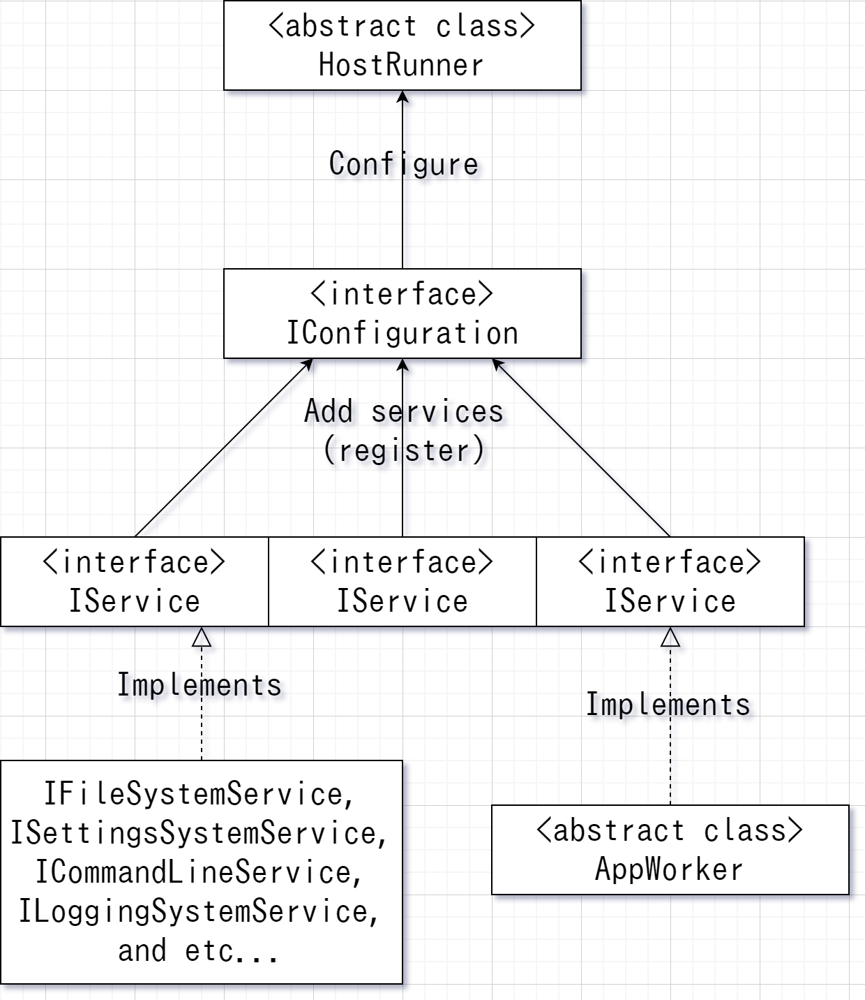

# ExapisSOP 設計思想 > 概念
Copyright (C) 2020 Takym.

<a id="hostrunner"></a>
## 実行環境とサービス
実行環境とは<xref:ExapisSOP.HostRunner>クラスとその派生クラスのインスタンスの事で、
アプリケーション全体と登録されたサービスを管理し実行します。
一つのアプリケーション内に一つのみ実行環境を作成する事ができます。
サービスとは<xref:ExapisSOP.IService>インターフェースを実装したクラスの事です。
サービスは様々な種類があり、プログラムに機能を提供します。

上記の図の様にサービスを構成設定(<xref:ExapisSOP.IConfiguration>)に登録する事で実行環境内で実行する事ができます。
下記のコードは実行環境を生成し構成設定を書き換えます。
```csharp
// string[] args にコマンド行引数が格納されていると仮定します。
var host = HostRunner.Create(args); // 実行環境を生成します。
host.Configure((config) => { // 構成設定を書き換える関数を実行環境へ提供します。
	config.AddService(...); // サービスを追加します。
	// 以下の様に一行に繋げる事もできます。また、できるだけ一行に繋げる事を推奨します。
	config.AddService(/*サービスオブジェクト*/).AddService(/*サービスオブジェクト*/).AddService(/*サービスオブジェクト*/);
});
```
ExapisSOP ではコマンドライン引数は**コマンド行引数**と省略します。

<a id="appworker"></a>
## AppWorker
アプリケーションは<xref:ExapisSOP.AppWorker>の派生クラスを一つ以上作成しそこに処理を記述します。
<xref:ExapisSOP.AppWorker>もサービスです。以下のコードの様に記述します。
```csharp
class Program : AppWorker
{
	// サービス初期化時に呼び出されます。
	public override async Task InitializeAsync(IContext context)
	{
		// 開始処理を登録します。
		this.Startup += this.Program_Startup;
		// 更新処理を登録します。
		this.Update += this.Program_Update;
		// 終了処理を登録します。
		this.Shutdown += this.Program_Shutdown;
		// 既定クラスの InitializeAsync を呼び出します。
		await base.InitializeAsync(context);
	}

	// アプリケーション開始時に呼び出されます。
	void Program_Startup(object? sender, ContextEventArgs e)
	{
		// ここにアプリケーション開始時に行うべき動作を記述します。
	}
	
	// アプリケーション更新時に呼び出されます。
	void Program_Update(object? sender, ContextEventArgs e)
	{
		// ここにアプリケーション更新時に行うべき動作を記述します。

		// アプリケーションを終了するには TerminationException を発生させます。
		throw new TerminationException();

		// このイベントは TerminationException が呼び出されるまで延々と呼び出され続けます。
	}
	
	// アプリケーション終了時に呼び出されます。
	void Program_Shutdown(object? sender, ContextEventArgs e)
	{
		// ここにアプリケーション終了時に行うべき動作を記述します。
	}
}
```
<xref:ExapisSOP.AppWorker>は`AddAppWorker<TAppWorker>()`を利用し実行環境へ登録します。
`TAppWorker`は<xref:ExapisSOP.AppWorker>から派生したクラスを表します。
```csharp
// string[] args にコマンド行引数が格納されていると仮定します。
var host = HostRunner.Create(args); // 実行環境を生成します。
host.Configure((config) => { // 構成設定を書き換える関数を実行環境へ提供します。
	config.AddAppWorker<Program>(); // Program を AppWorker として実行する様に登録します。
});
```

<a id="context"></a>
## 文脈情報
文脈情報とは<xref:ExapisSOP.IContext>インターフェースの事です。
実行環境により自動的に生成され、サービスへ提供されます。
実行に必要な様々な情報を保持しています。
サービス間での情報の受け渡しには文脈情報を利用します。

<a id="file_system"></a>
## ファイル管理サービス
<xref:ExapisSOP.IO.IFileSystemService>はファイルを管理する機能を提供します。
以下の様にして登録します：
```csharp
config.AddFileSystem();
```

<a id="settings_system"></a>
## 設定情報管理サービス
<xref:ExapisSOP.IO.Settings.ISettingsSystemService>は設定情報を管理する機能を提供します。
このサービスを利用する場合はファイル管理サービスを登録しておく必要があります。
以下の様にして登録します：
```csharp
config.AddFileSystem().AddSettingsSystem();
```

<a id="command_line"></a>
## コマンド行引数解析サービス
<xref:ExapisSOP.IO.Settings.CommandLine.ICommandLineService>はコマンド行引数を解析する機能を提供します。
このサービスを利用する場合は設定情報管理サービスを登録しておく必要があります。
以下の様にして登録します：
```csharp
config.AddFileSystem().AddSettingsSystem().AddCommandLine();
```

<a id="logging_system"></a>
## ログ出力管理サービス
<xref:ExapisSOP.IO.Logging.ILoggingSystemService>はログ出力を管理する機能を提供します。
このサービスを利用する場合は設定情報管理サービスを登録しておく必要があります。
また、コマンド行引数解析サービスと併用する場合は、このサービスはコマンド行引数解析サービスより後に登録しなければなりません。
以下の様にして登録します：
```csharp
// コマンド行引数解析サービスを追加しない場合：
config.AddFileSystem().AddSettingsSystem().AddLoggingSystem();
// コマンド行引数解析サービスを追加する場合：
config.AddFileSystem().AddSettingsSystem().AddCommandLine().AddLoggingSystem();
// または以下の様に書けます：
config.AddSystemServices();
```
